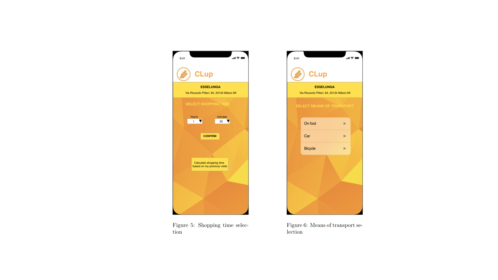

# Software_Engineering_2_Project
Requirements Analysis and Specification (RASD) and Design documents for a software system designed to regulate accesses to a store through "virtual queueing" and booking

